# Database Experiment 1: Manipulating Data With SQL

This is the intellectual property of **171860611, 王麦迪**.

You can contact me via **QQ: 1772761454**

## Environment

```shell
$ mysql --version
mysql  Ver 14.14 Distrib 5.7.27, for Linux (x86_64) using  EditLine wrapper
```

## Experiment Process

### 1. Creating Tables

Before creating tables, a database must be first created and entered:

```mysql
create database Experiment;
use Experiment;
```

#### 1.1 - 1.4

Now we can create tables:

```mysql
create table Course (
    id int primary key comment '课程号',
    title char(20) not null comment '课程名',
    dept_name char(2) comment '院系名',
    credit int comment '学分'
);
create table Student (
    id int primary key comment '学号',
    name char(20) not null comment '姓名',
    dept_name char(2) comment '院系名'
);
create table SC (
    student_id int,
    course_id int,
    year int,
    grade int,
    primary key (student_id, course_id)
);
create table Teacher (
    id int primary key comment '教师编号',
    name char(8) not null comment '教师姓名',
    dept_name char(2) comment '所在系',
    salary int comment '工资'
);
```

#### Result

Check to see if table constraints are as required:

```mysql
describe Course;
describe Student;
describe SC;
describe Teacher;
```

<left>
    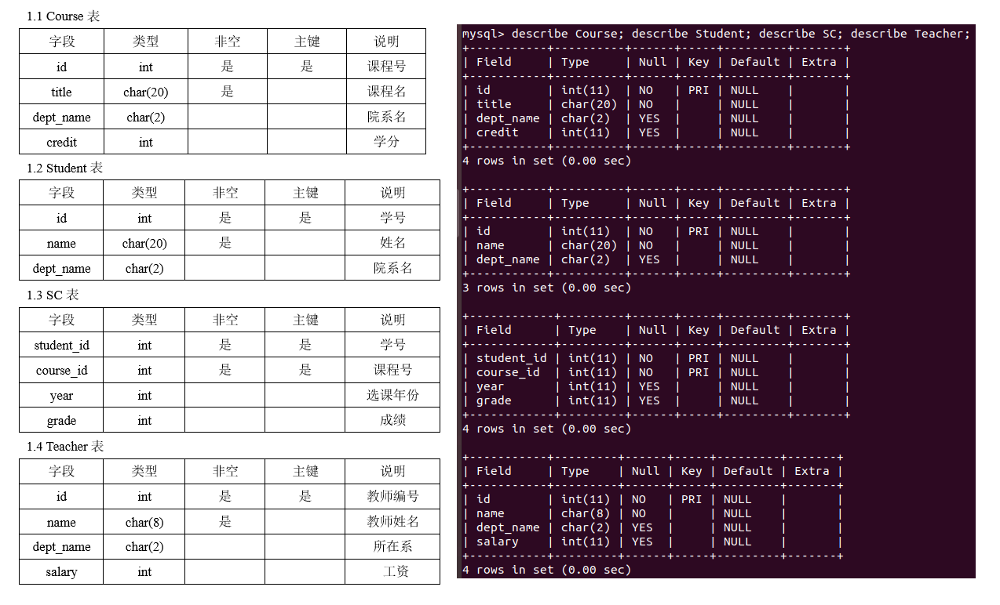
</left>

### 2. Altering Tables

This is easy, just follow the syntax in [MySQL Official Documents](https://dev.mysql.com/doc/refman/5.7/en/)

#### 2.1

```mysql
alter table Student add age smallint;
describe Student;
```

<left>
    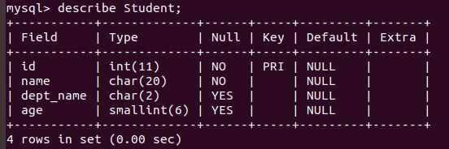
</left>

#### 2.2

```mysql
alter table Student modify age int;
describe Student;
```

<left>
    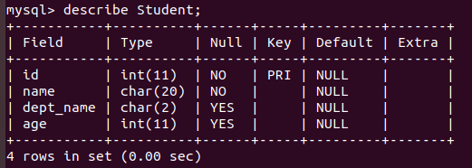
</left>

### 3. Inserting Data

The syntax for inserting data is also in [MySQL Official Documents](https://dev.mysql.com/doc/refman/5.7/en/). The hard part here is making up the right data

#### 3.1 - 3.4

```mysql
insert into Student (id, name, dept_name, age) values (171860601, 'Student1', 'CS', 20), (171860602, 'Student2', 'CS', 21), (171860603, 'Student3', 'CS', 20), (171860604, 'Student4', 'CS', 19), (171860605, 'Student5', 'MA', 20), (171860606, 'Student6', 'MA', 19), (171860607, 'Student7', 'PY', 20), (171860608, 'Student8', 'PY', 20), (171860609, 'Student9', 'CH', 22), (171860610, 'Student10', 'CH', 19);

insert into Course (id, title, dept_name, credit) values (101, 'Database', 'CS', 3), (102, 'Java', 'CS', 2), (201, 'Calculus', 'MA', 5), (301, 'Thermodynamics', 'PY', 3), (401, 'Organic Chemistry', 'CH', 4);

insert into SC (student_id, course_id, year, grade) values (171860601, 101, 2017, 80), (171860601, 102, 2017, 88), (171860602, 101, 2018, 75), (171860602, 102, 2018, 60), (171860603, 101, 2019, 95), (171860603, 201, 2019, 94), (171860604, 201, 2018, 88), (171860604, 301, 2019, 89), (171860605, 201, 2017, 42), (171860605, 101, 2018, 59), (171860606, 201, 2017, 95), (171860606, 101, 2017, 98), (171860607, 301, 2018, 60), (171860607, 401, 2019, 60), (171860608, 301, 2017, 85), (171860608, 102, 2019, 75), (171860609, 401, 2019, 75), (171860609, 301, 2019, 80), (171860610, 401, 2019, 78), (171860610, 102, 2018, 80);

insert into Teacher (id, name, dept_name, salary) values (1, 'HuWei', 'CS', 20000), (2, 'HuHua', 'MA', 18000), (3, 'HuShi', 'CH', 12000), (4, 'BuLei', 'CS', 15000), (5, 'TaoYu', 'MA', 12000);
```

#### Result

Check to see if data is in tables:

```mysql
select * from Student;
select * from Course;
select * from SC;
select * from Teacher;
```

<left>
    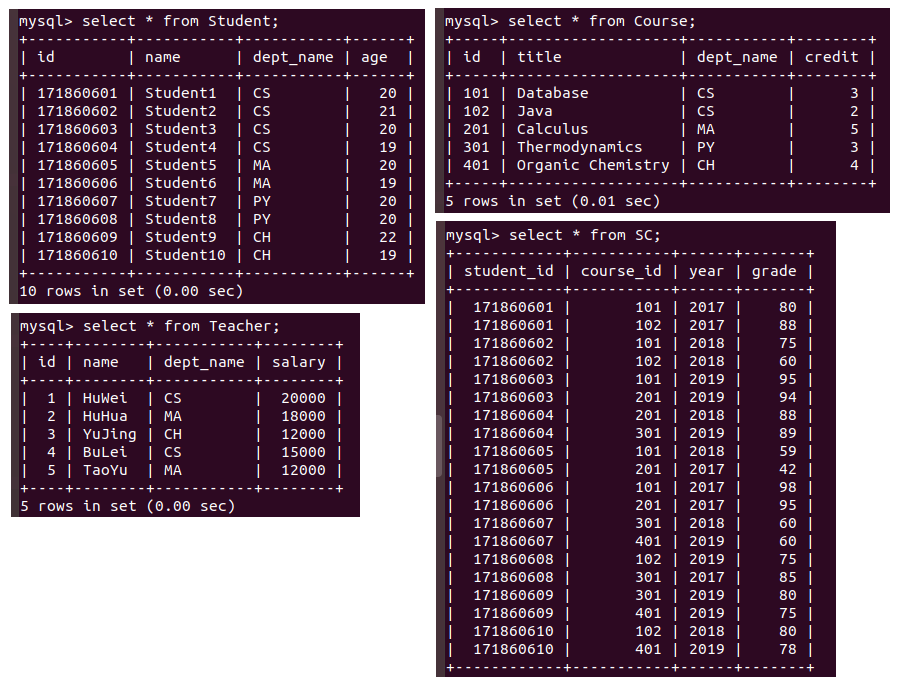
</left>

### 4. Querying

#### 4.1

The first query can be done in a brute force way:

```mysql
select distinct Student.name from Student, SC, Course
	where Student.id=SC.student_id and SC.course_id=Course.id and Course.dept_name='CS';
```

Yet it can be modified by using a subquery:

```mysql
select name from Student
	where id in (
        select distinct student_id from SC, Course
        where SC.course_id=Course.id and Course.dept_name='CS'
    );
```

This can be further modified by yet using another subquery:

```mysql
select name from Student
	where id in (
        select distinct student_id from SC
        where course_id in (
            select id from Course 
            where dept_name='CS'
        )
    );
```

<left>
    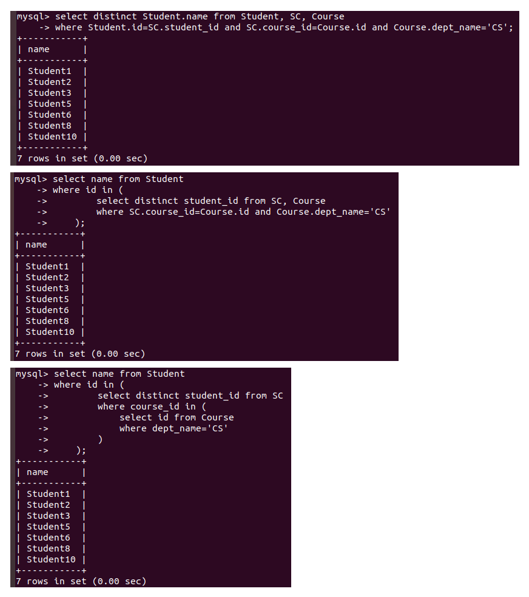
</left>

#### 4.2

The second query is done with the `like` predicate. However, there are a lot of bugs here due to language issues. MySQL's char(n) doesn't accept Chinese characters as input:

<left>
    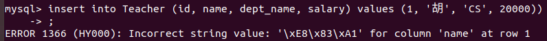

This would mean that the following query would also select `Hua`, `Huang`, `Hui`, `Huo`, `Huai`, `Huan` and other names that look like `Hu` but aren't `胡` in Chinese.

```mysql
select name, dept_name from Teacher where name like 'Hu%';
```

<left>
    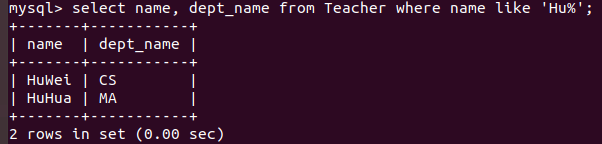
</left>

This is issued as a **Problem** below.

#### 4.3

The third query is done by finding students who have chosen classes before 2018 and then picking out students who aren't in this set:

```mysql
select id, name from Student 
	where id not in (select distinct student_id from SC where year<=2018);
```

<left>
    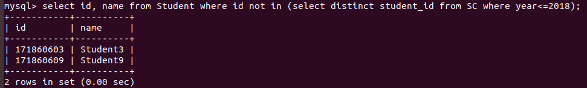
</left>

#### 4.4

The fourth query is done by first grouping teachers by their department and then using `MySQL's` own function `max`:

```mysql
select dept_name, max(salary) from Teacher group by dept_name;
```

<left>
    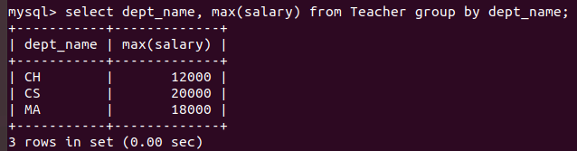
</left>

### 5. Updating Data

The syntax for update is in  [MySQL Official Documents](https://dev.mysql.com/doc/refman/5.7/en/).

This is achieved by first getting the course_id of `Database`, and then adding 2 to the grade of any tuple with `Database's` course_id. There might be a problem with constraints, as we know grades are normally <= 100. This is also issued as a **Problem** below, as this constraint should have been added when creating table.

```mysql
drop table SC;
create table SC (
    student_id int,
    course_id int,
    year int,
    grade int check (grade>=0 and grade<=100),
    primary key (student_id, course_id)
);
insert into SC (student_id, course_id, year, grade) values (171860601, 101, 2017, 80), (171860601, 102, 2017, 88), (171860602, 101, 2018, 75), (171860602, 102, 2018, 60), (171860603, 101, 2019, 95), (171860603, 201, 2019, 94), (171860604, 201, 2018, 88), (171860604, 301, 2019, 89), (171860605, 201, 2017, 42), (171860605, 101, 2018, 59), (171860606, 201, 2017, 95), (171860606, 101, 2017, 98), (171860607, 301, 2018, 60), (171860607, 401, 2019, 60), (171860608, 301, 2017, 85), (171860608, 102, 2019, 75), (171860609, 401, 2019, 75), (171860609, 301, 2019, 80), (171860610, 401, 2019, 78), (171860610, 102, 2018, 80);
```

After adding the check constraint, we can safely add 2 to grades of `Database`:

```mysql
update SC set grade=grade+2 
	where course_id=(select id from Course where title='Database');
```

<left>
    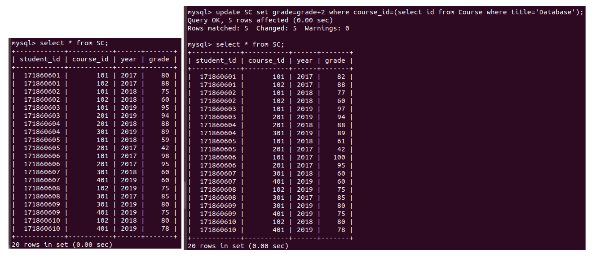
</left>

### 6. Deleting Data

This is where I met a problem `you can't specify target table for update in from clause`. I referred to [Stack Overflow Help](https://stackoverflow.com/questions/4429319/you-cant-specify-target-table-for-update-in-from-clause) for help.

```mysql
delete from SC 
	where SC.student_id in (
        select id from Student 
        	where 80>(
                select avg(grade) from SC as StudentCourse
                	where StudentCourse.student_id=Student.id
            )
    );
```

<left>
    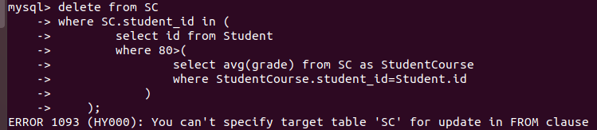
</left>

And it was fixed by using clause `(select * from SC)` instead of using `SC` directly:

```mysql
delete from SC 
	where SC.student_id in (
        select id from Student 
        	where 80>(
                select avg(grade) from (select * from SC) as StudentCourse
                	where StudentCourse.student_id=Student.id
            )
    );
select * from SC;
```

<left>
    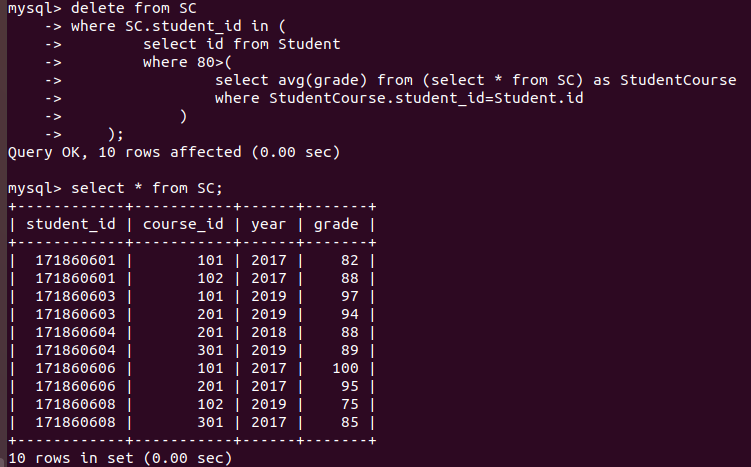
</left>

Since this is `MySQL's` own problem, I will not issue this as a **Problem** of this experiment.

### 7. Creating View

View [MySQL Official Documents](https://dev.mysql.com/doc/refman/5.7/en/) for syntax help.

```mysql
create view creditView as (
    select student_id, sum(credit) from SC, Course where course_id=id group by student_id
);
select * from creditView;
```

<left>
    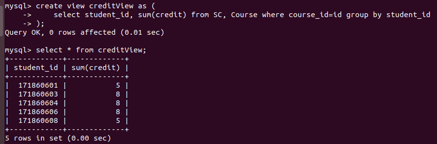
</left>

This view is based on the table after Deleting data.

### 8. Deleting Tables

Nothing to say here.

```mysql
drop table SC;
```

## Problems and Suggestions

### Problems

1. When querying for teachers with the last name of `胡`, it is possible for other teachers' name to be selected too due to language issues.
2. When adding 2 to grades of students taking `Database`, it is possible for grades to go beyond `100`, constraints are needed.

### Suggestions

1. I would recommend that you encourage us to us `Markdown` files to write code. `Word` isn't fit for displaying code. As you can see, `Markdown` files offer syntax highlighting and ignores details like font, size, style.
2. I would also recommend that you encourage us to use `English`.

##  Reference

[MySQL Official Documents](https://dev.mysql.com/doc/refman/5.7/en/)

[Stack Overflow Help](https://stackoverflow.com/questions/4429319/you-cant-specify-target-table-for-update-in-from-clause)