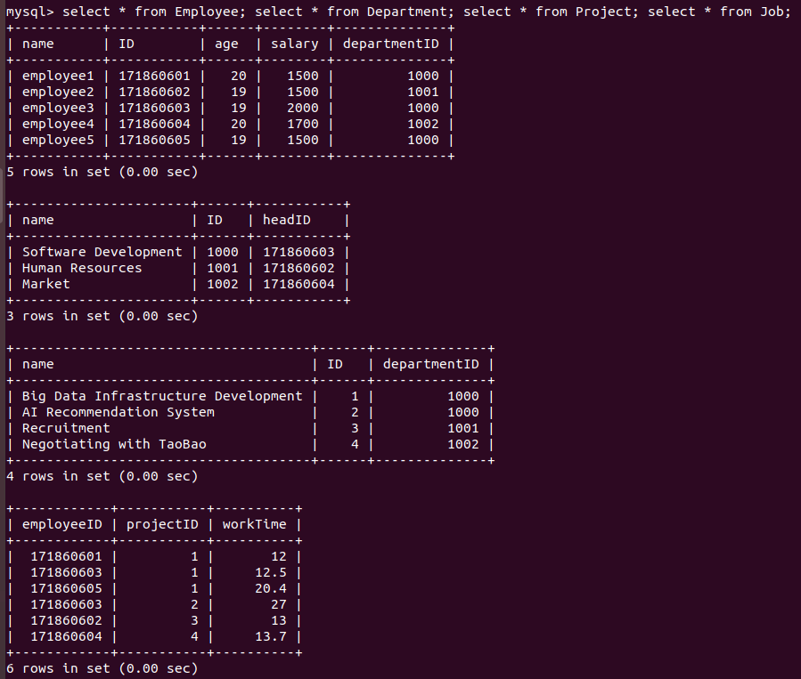
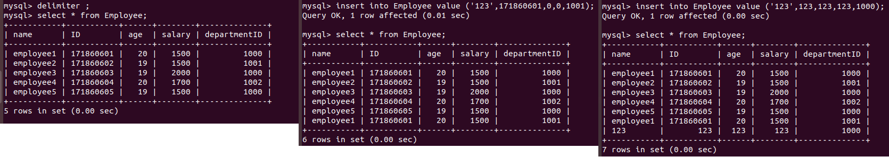
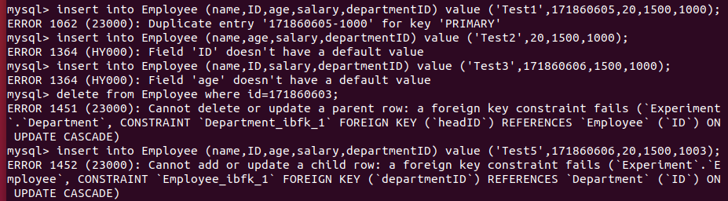
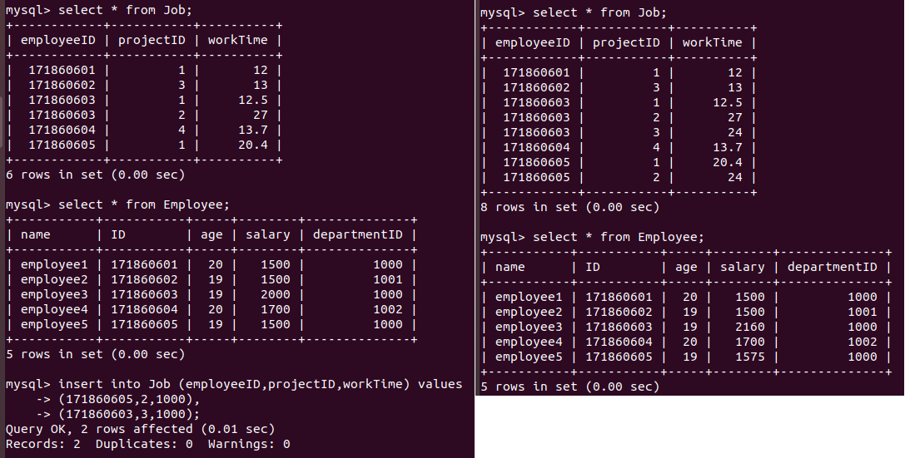
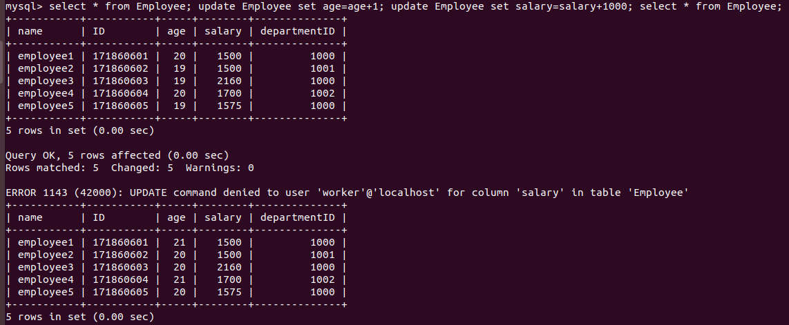
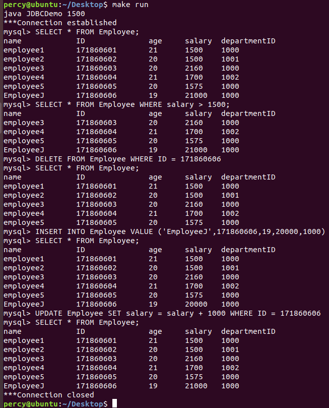
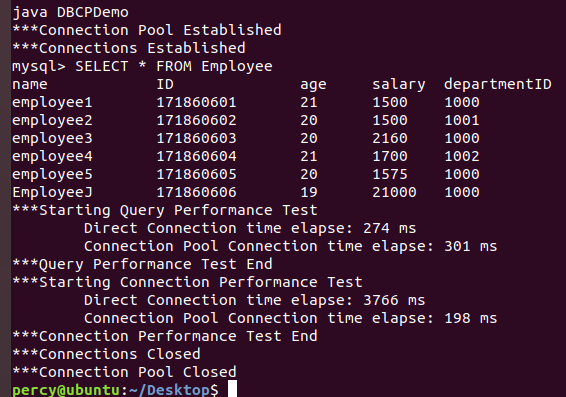

# Database Experiment 2

This is the intellectual work of **171860611, 王麦迪**. I can be reached via **QQ: 1772761454**. All copyrights reserved.

## Environment

```shell
$ mysql --version
mysql  Ver 14.14 Distrib 5.7.28, for Linux (x86_64) using  EditLine wrapper
```

## Process

### 1. Define Tables

The first step to creating tables is creating a database:

```mysql
create database Experiment; use Experiment;
```

Now we can create tables. Constraints are left for later parts.

```mysql
create table Employee (name char(30),ID int,age tinyint,salary int,departmentID int);
create table Department (name char(30),ID int,headID int);
create table Project (name char(50),ID int,departmentID int);
create table Job (employeeID int,projectID int,workTime double);
```

Check table definitions with the command:

```mysql
describe Employee; describe Department; describe Project; describe Job;
```

Then we fill the tables with some sample data:

```mysql
insert into Employee (name,ID,age,salary,departmentID) values ('employee1',171860601,20,1500,1000),
('employee2',171860602,19,1500,1001),
('employee3',171860603,19,2000,1000),
('employee4',171860604,20,1700,1002),
('employee5',171860605,19,1500,1000);

insert into Department (name,ID,headID) values
('Software Development',1000,171860603),
('Human Resources',1001,171860602),
('Market',1002,171860604);

insert into Project (name,ID,departmentID) values
('Big Data Infrastructure Development',1,1000),
('AI Recommendation System',2,1000),
('Recruitment',3,1001),
('Negotiating with TaoBao',4,1002);

insert into Job (employeeID,projectID,workTime) values
(171860601,1,12),
(171860603,1,12.5),
(171860605,1,20.4),
(171860603,2,27),
(171860602,3,13),
(171860604,4,13.7);
```

Check with the command:

```mysql
select * from Employee; select * from Department; select * from Project; select * from Job;
```

This is the screen-capture of the tables after data is inserted:

<center>
    
</center>

### 2. Adding Constraints

#### 2.1 Primary Key

After analyzing the relations between the three entities `Department`, `Employee`, and `Project`, I found three weak assumptions:

1. Every employee can only be in one department.
2. Every department can only have one head.
3. Every project can only belong to one department.

In reality, these assumptions do not hold, especially in start-up companies. This is issued as a [problem](#Problems and Solutions).

The assumption are considered as weak because they can be solved by setting multiple primary keys, but that raises new problems.

For example, we could set the primary key for `Employee` as `ID-departmentID`, and now an employee can have multiple entries belonging to different departments. But we have to make sure that the name, age and salary are the same for the same Employee(ID).

A better way would be to split the Employee table into two sub-tables.

There is the same problem for `Department` and `Project`.

Since I can't split these tables due to homework requirements(the best solution), and I want my table to be more realistic, two options remain:

1. Assuming that everything is valid and do nothing.
2. Add triggers to fix things for the same ID.

To make this analysis meaningful, I choose option 2.

```mysql
alter table Employee add primary key (ID,departmentID);
alter table Department add primary key (ID,headID);
alter table Project add primary key (ID,departmentID);
alter table Job add primary key (employeeID,projectID);

delimiter //
create trigger EmployeeCheck before insert on Employee
for each row
begin
	if exists (select * from Employee where ID = new.ID) then set
	new.name = (select distinct name from Employee where ID = new.ID),
	new.age = (select distinct age from Employee where ID = new.ID),
	new.salary = (select distinct salary from Employee where ID = new.ID);
	end if;
end; //
delimiter ;

delimiter //
create trigger DepartmentCheck before insert on Department
for each row
begin
	if exists (select * from Department where ID = new.ID) then set
	new.name = (select distinct name from Department where ID = new.ID);
	end if;
end; //
delimiter ;

delimiter //
create trigger ProjectCheck before insert on Project
for each row
begin
	if exists (select * from Project where ID = new.ID) then set
	new.name = (select distinct name from Project where ID = new.ID);
	end if;
end; //
delimiter ;
```

To prove that it works:

<center>
    
</center>

#### 2.2 Not Null

Every field is to set `NOT NULL`.

```mysql
alter table Employee modify name char(30) not null, modify age tinyint not null, modify salary int not null;
alter table Department modify name char(30) not null;
alter table Project modify name char(50) not null;
alter table Job modify workTime double not null;
[describe Employee; describe Department; describe Project; describe Job;]
```

#### 2.3 Foreign Key

Employee(departmentID) references Department(ID); Department(headID) references Employee(ID); Project(departmentID) references Department(ID); Job(employeeID) references Employee(ID); Job(projectID) references Project(ID).

Since `update` should be synchronized and `delete` should be restricted, the clause `on update cascade on delete restrict` is added for all foreign key constraints.

```mysql
alter table Employee add foreign key (departmentID) references Department (ID) on update cascade on delete restrict;
alter table Department add foreign key (headID) references Employee (ID) on update cascade on delete restrict;
alter table Project add foreign key (departmentID) references Department (ID) on update cascade on delete restrict;
alter table Job add foreign key (employeeID) references Employee (ID) on update cascade on delete restrict;
alter table Job add foreign key (projectID) references Project (ID) on update cascade on delete restrict;
```

### 3. Testing

As a **TDD** fan, this part is especially important for me. Since the four tables are somewhat identical, I am only testing the `Employee` table. The tests can be divided into three equivalent classes consistent with the constraints added above:

1. Primary key constraints
   1. Duplicate
   2. Missing
2. Not null key constraints
   1. Missing (only valid using `ID` that doesn't already exist in the table due to the trigger I added)
3. Foreign key constraints
   1. Delete
   2. Insert with non-existent foreign key

```mysql
insert into Employee (name,ID,age,salary,departmentID) value ('Test1',171860605,20,1500,1000);
insert into Employee (name,age,salary,departmentID) value ('Test2',20,1500,1000);
insert into Employee (name,ID,salary,departmentID) value ('Test3',171860606,1500,1000);
delete from Employee where id=171860603;
insert into Employee (name,ID,age,salary,departmentID) value ('Test5',171860606,20,1500,1003);
```

<center>
    
</center>

### 4. Triggers

Nothing much to say about this part.

#### 4.a WorkTimeCheck

```mysql
delimiter //
create trigger workTimeCheck before insert on Job
for each row
begin
	if new.worktime > 24 then set new.worktime = 24;
    end if;
end; //
delimiter ;
```

#### 4.b SalaryIncrease

```mysql
drop trigger salaryIncrease;
delimiter //
create trigger salaryIncrease after insert on Job
for each row
begin
	if new.employeeID in (select headID from Department) then update Employee set salary = salary * 1.08 where Employee.ID = new.employeeID;
	else update Employee set salary = salary * 1.05 where Employee.ID = new.employeeID;
	end if;
end; //
delimiter ;
```

<center>
    
</center>

Just in case you miss it, 171860603 is in head of a department while 171860605 isn't.

### 5. Worker

```mysql
create user worker; grant select on Experiment.Employee to worker; grant update (age) on Experiment.Employee to worker; exit;
```

Check the existence of `worker` and privileges via command:

```mysql
select User from mysql.user; show grants for worker;
```

Then we try to update things using worker:

```shell
mysql -u worker -A Experiment
```

```mysql
select * from Employee; update Employee set age=age+1; update Employee set salary=salary+1000; select * from Employee; exit;
```

```shell
sudo mysql
```

```mysql
drop user worker;
```

<center>
    
</center>

### 6. JDBC

I am also showing the steps for downloading and configuring `Java` and `JDBC`, since I'm not using an IDE and recording this procedure helps:

```shell
tar -xzvf jdk-8u221-linux-x64.tar.gz
sudo mv jdk1.8.0_221 /usr/local/java
sudo apt-get install libmysql-java
gedit ~/.bashrc
###
export JAVA_HOME=/usr/local/java
export PATH=${JAVA_HOME}/bin:${PATH}
export CLASSPATH=$CLASSPATH:/usr/share/java/mysql.jar
###
source ~/.bashrc
```

Before starting, I have to point out that I see no point in writing SQL in the command line and passing it to the Java program which then passes it onto the connection with the database. That is only adding a wrapper around `MySQL Shell`. I also have to point out that if we were to achieve functionality this way, there would be no way to use `Dynamic SQL` since everything is determined by the command line.

Thus, I have coded the `SQL` commands within the Java program, and used `Dynamic SQL` by getting a salary threshold via the command line. Since the code is not required in this report and space is limited, I am adding all my code as a separate file. Again, I'm not using and IDE so I have to add `classpaths`, compile and run Java programs manually. To make things easier, I've written a `makefile` script. Compile via `sudo make`, run via `sudo make run`.

<center>
    
</center>

### 7. DBCP

The source code is within the attached files. Within the code you will find that I have written assignment 1 & 2. Since there is nothing to say about assignment 1, I am only introducing assignment 2 here.

The idea is simple: test query performance and connection performance separately.

#### Query Performance

By intuition, query performance should be roughly the same. But considering the buffer mechanisms within the database, if I were to directly test performance, the second tested connection should be faster since the results are in the buffer due to the first tested connection. So before testing them, I added a loop to execute queries and make sure that everything was in the buffer before actually testing the two connections.

It turns out that they are roughly the same: 280 ~ 300 ms.

#### Connection Performance

So much can be done in this part that I was overwhelmed with what to do. So I chose the simplest approach: connect, close and reconnect. This results in dramatic performance differences, which can be considered as an upper bound for performance difference between the two connections because:

1. Direct connection has to reconnect every time.
2. Connection Pool never has to open new connections because there is always only one connection in use.

The results differ at a ratio of 20, dramatically showing the advantage of a connection pool. 

<center>
    
</center>

Performance tests should actually be tested multiple times to form a sample large enough to analyze. Unfortunately, I do not have that much time, keeping the workload for this part to a minimum.

## Problems and Solutions

### 1. Table Design

In reality, each employee can belong to multiple departments, departments can have multiple heads, projects can belong to multiple departments. So an employee shouldn't be defined singularly by the department he or she is in.

The best solution is to redesign tables, but the fix for now is using multiple primary keys and adding triggers to make sure inserting info for the same ID stays consistent.

### 2. Dynamic SQL

There is no way to use `Dynamic SQL` when all SQL commands are obtained via the command line.

## Reference

[Java1.8 API Documents](https://docs.oracle.com/javase/8/docs/api/)

[Commons-DBCP-BasicDataSource](https://commons.apache.org/proper/commons-dbcp/api-1.4/org/apache/commons/dbcp/BasicDataSource.html)